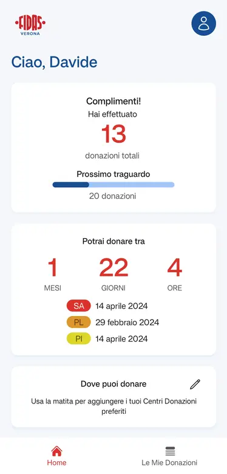
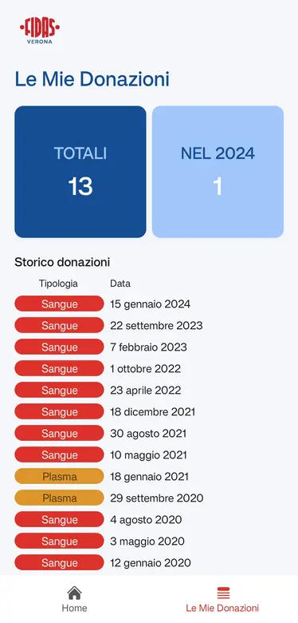
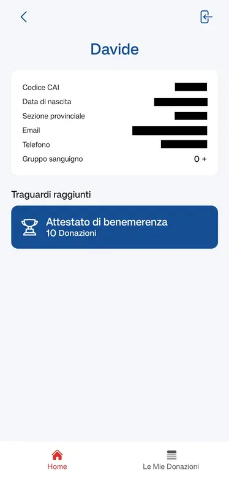

# FIDAS Verona app

[](https://github.com/pizidavi/fidas-verona-app/releases)

[FIDAS Verona](https://www.fidasverona.it) – Federazione Italiana Associazioni Donatori di Sangue 🩸

## Download

Get the app from the [releases page](https://github.com/pizidavi/fidas-verona-app/releases/latest).

## Screenshots

|               Home                |                  Donations                  |               User                |
| :-------------------------------: | :-----------------------------------------: | :-------------------------------: |
|  |  |  |

## Development

### Project setup

Clone the project

```bash
git clone https://github.com/pizidavi/fidas-verona-app.git
```

Go to the project directory and install the dependencies

```bash
yarn install
```

### Environment setup

A `.env` file is needed to run this application.
An example `.env.sample` file can be found inside the repository

| Parameter                         | Required | Type     |
| :-------------------------------- | :------- | :------- |
| `EXPO_PUBLIC_API_URL`             | `true`   | `string` |
| `EXPO_PUBLIC_LEGACY_API_URL`      | `true`   | `string` |
| `EXPO_PUBLIC_LEGACY_COMPANY_ID`   | `true`   | `number` |
| `EXPO_PUBLIC_FORGOT_PASSWORD_URL` | `true`   | `string` |
| `EXPO_PUBLIC_REPOSITORY_URL`      | `true`   | `string` |
| `EXPO_PUBLIC_DEV_USER`            | `false`  | `string` |
| `EXPO_PUBLIC_DEV_PASSWORD`        | `false`  | `string` |

### Create native files

```bash
npx expo prebuild
```

This app use custom native code, [Expo Development Build](https://docs.expo.dev/develop/development-builds/introduction) are required

### Start application

```bash
yarn dev
```

## License

This project is licensed under the GNU General Public License v3.0 - see the [LICENSE](LICENSE) file for details.

## Disclaimer

This project is not affiliated with FIDAS Verona. The data displayed in this app is sourced from FIDAS Verona. Any issues or concerns regarding the functionality of the app should be directed to this repository and not to FIDAS Verona.
